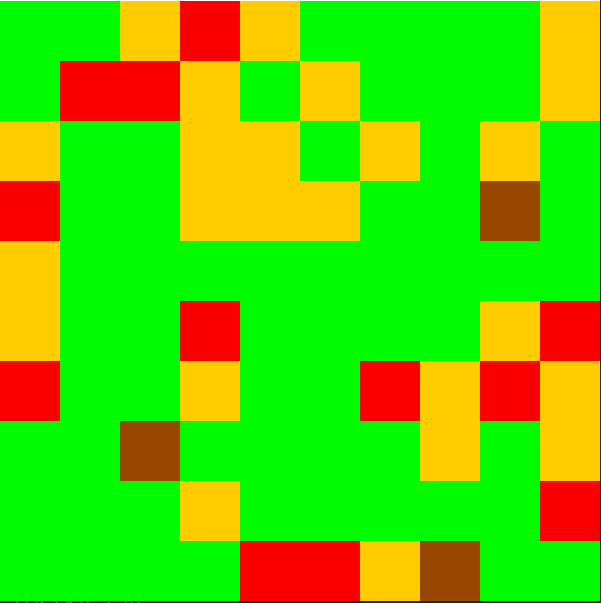

# AASMA
## Deep Q Learning Drone Patroller

## Installation (Makefile)

To install aasma, run 'make'.
To uninstall it, run 'make uninstall'.
You can uninstall and re-install with 'make reset'.

For example, when running the project for the first time do:

```console
make reset
```

## Environment

The AASMA Environment is imported directly by whatever scripts need it.
The environment is a grid world containing 5 types of cells:

* Mountains
* Fires
* Green cells
* Yellow cells
* Red cells

The goal is to minimize the occurrence of fires which are
the evolution of a red cell.

The evolution of the cells is **Green -> Yellow -> Red -> Fires -> Green**.
Mountains do not change.

The configuration of the environment can be altered in the file **config.json**.

The environment can be seen below.



## Single Agent

The agent related files are responsible for controlling the brain of the drone.

The Agent's type can be one of **random** or **drl** or **reactive**.

The *Random Agent* just chooses a random action at any given time.
The *Reactive Agent* sees the environment, all sees the closest red cells.
Only then it tries to eliminate them.

The *DRL Agent*, however, is controlled by a neural net which receives
an image of the entire environment as input.
It then has to decide which action is the best.

To train the neural net run:
```console
python aasma/train.py
```

You can visualize the input passed to the neural net by running:
```console
python aasma/grabber.py
```


## Multi Agent

Multi agent **training** is not supported as is.
To do it you would need to alter *train.py*.
What is encouraged is transfer learning from a single agent domain to a multi agent one.


All results were obtained by training on a NVIDIA GTX 1070.
